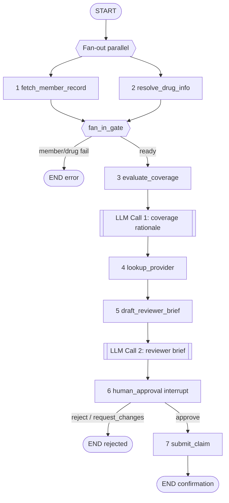

# LangGraph Pharmacy Insurance Claim Orchestration

Educational demo only. **Not for real insurance billing, medical advice, or PHI.** Use synthetic member/claim data only.

A fully runnable **LangGraph** workflow that orchestrates a pharmacy insurance claim with:

- Parallel **fan-out / fan-in** (member + drug)
- Deterministic coverage rules + **LLM Call 1** rationale (`llm_coverage_rationale`)
- CMS **NPI Registry** provider lookup
- **LLM Call 2** reviewer brief (`llm_reviewer_brief`)
- **Human-in-the-loop** interrupt before submit
- SQLite checkpointing (resume after restart)
- FastAPI + Postman collection + offline/online evals
- Deployable to **Azure Cloud Foundry**

---

## Flow (required graph)

```text
START
  |
  +-- fan-out (parallel) ------------------+
  |                                        |
  v                                        v
1. fetch_member_record              2. resolve_drug_info
  |                                        |
  +--------------- fan-in (fan_in_gate) ---+
                    |
                    v
           3. evaluate_coverage
              (rules + LLM Call 1: rationale)
                    |
                    v
           4. lookup_provider   (NPI Registry)
                    |
                    v
           5. draft_reviewer_brief   (LLM Call 2)
                    |
                    v
           6. human_approval    (HITL interrupt)
                    |
          +---------+---------+
          | approve           | reject / changes
          v                   v
  7. submit_claim            END (no submit)
```



### Fan-out / fan-in join pattern

LangGraph edges from `START` to both `fetch_member_record` and `resolve_drug_info` run **in parallel**. Both branches edge into `fan_in_gate`, which LangGraph schedules only after **both** predecessors complete. Conditional routing (`after_fan_in`) then sends the run to `evaluate_coverage` or `END`. Message lists use an append reducer so parallel writes do not clobber each other.

### Invalid NPI behavior (documented)

If pharmacy/prescriber NPI is invalid, **LLM Call 1 still runs**, coverage is escalated to `needs_review` (R6), **LLM Call 2 still runs** so the examiner sees a brief, and HITL remains mandatory. No auto-submit.

---

## Quick start (local)

```bash
# 1) Python 3.11+
python -m venv .venv
# Windows
.venv\Scripts\activate
# macOS/Linux
# source .venv/bin/activate

# 2) Install
pip install -r requirements.txt

# 3) Config
copy .env.example .env   # Windows
# cp .env.example .env   # macOS/Linux
# Edit .env — set OPENAI_API_KEY or Azure OpenAI vars.
# Without keys, set LLM_FORCE_FALLBACK=true (template rationales/briefs).

# 4) Run API
uvicorn app.main:app --reload --host 0.0.0.0 --port 8000
```

Open http://localhost:8000/docs · Health: http://localhost:8000/health

Optional Streamlit examiner UI:

```bash
streamlit run ui/approval_app.py
```

---

## Configuration (`.env`)

All secrets and model settings are read from `.env` via `app/config.py`:

| Variable | Purpose |
|----------|---------|
| `LLM_PROVIDER` | `openai` or `azure` |
| `OPENAI_API_KEY` / `OPENAI_MODEL` | OpenAI chat model |
| `AZURE_OPENAI_*` | Azure OpenAI endpoint, key, deployment |
| `LLM1_TEMPERATURE` / `LLM2_TEMPERATURE` | Low temps for Call 1 / Call 2 |
| `LLM_FORCE_FALLBACK` | Force template LLM outputs (no API calls) |
| `LANGCHAIN_TRACING_V2` / `LANGCHAIN_API_KEY` / `LANGCHAIN_PROJECT` | LangSmith |
| `CHECKPOINT_DB_PATH` | SQLite path for HITL resume |

---

## API contract

| Method | Endpoint | Behavior |
|--------|----------|----------|
| POST | `/claims/intake` | Start graph; returns `claim_id`, status |
| GET | `/claims/{claim_id}` | Current state (rationale + brief) |
| POST | `/claims/{claim_id}/approve` | Human approve → submit |
| POST | `/claims/{claim_id}/reject` | Human reject → END |
| POST | `/claims/{claim_id}/request-changes` | Changes requested → END |
| GET | `/members/{member_id}` | Synthetic member |
| POST | `/payer/submit` | Mock payer submit |
| GET | `/payer/rules` | Formulary rules |
| GET | `/health` | Health + dependency URLs |

### Happy-path curl

```bash
curl -s -X POST http://localhost:8000/claims/intake -H "Content-Type: application/json" -d "{\"member_id\":\"MEM-10001\",\"pharmacy_npi\":\"1679576722\",\"prescriber_npi\":\"1679576722\",\"drug_name\":\"atorvastatin\",\"quantity\":30,\"days_supply\":30}"
```

Then approve with the returned `claim_id`:

```bash
curl -s -X POST http://localhost:8000/claims/<claim_id>/approve -H "Content-Type: application/json" -d "{\"reviewer_id\":\"rev-001\",\"comment\":\"Approve\"}"
```

---

## Coverage rules (`app/graph/rules.py`)

| Rule | Condition | Decision |
|------|-----------|----------|
| R1 | Member active + drug on preferred list | `covered` |
| R2 | Specialty / high-cost drug class | `prior_auth_required` |
| R3 | Quantity > plan max for days supply | `needs_review` |
| R4 | Drug not resolved | block at fan-in |
| R5 | Member missing/inactive | block at fan-in |
| R6 | Provider NPI invalid | `needs_review` (continue to LLM2 + HITL) |

**LLM Call 1 never overrides `coverage_status`** — rules set `rule_status` / `coverage_status`; the model only writes `coverage.rationale`.

---

## Public APIs used

| API | Node |
|-----|------|
| [RxNorm](https://rxnav.nlm.nih.gov/REST) | `resolve_drug_info` |
| [openFDA NDC](https://api.fda.gov/drug/ndc.json) | `resolve_drug_info` |
| [CMS NPI Registry](https://npiregistry.cms.hhs.gov/api-page) | `lookup_provider` |

---

## Postman

Import `postman/Pharmacy_Claim_Orchestration.postman_collection.json`.  
Set collection variable `baseUrl` to `http://localhost:8000` (or your CF route).  
Folders cover health, happy-path approve, reject, and error paths.

---

## Evaluations

### Offline

```bash
python -m eval.offline.run_offline_eval
```

- Dataset: `eval/offline/dataset.json` (22 cases)
- Results: `eval/offline/results.md`

### Online

See `eval/online/online_evaluators.md` and `eval/online/alert_thresholds.md` for LangSmith span checks, HITL integrity, non-override, and alert thresholds.

---

## Tests

```bash
pytest -q
```

---

## Azure Cloud Foundry deploy

See [`deploy/README.md`](deploy/README.md).

```bash
cf push -f deploy/manifest.yml
cf set-env pharmacy-claim-orchestration OPENAI_API_KEY "sk-..."
cf restage pharmacy-claim-orchestration
```

---

## Repository layout

```text
app/
  main.py                 # FastAPI
  config.py               # .env settings
  graph/                  # LangGraph state, rules, nodes, routing
  llm/                    # LLM Call 1 + Call 2
  clients/                # RxNorm, openFDA, NPI, member/payer mocks
  api/                    # REST routers
  services/               # claim runner
eval/offline|online/
postman/
deploy/
samples/sample_requests.json
ui/approval_app.py
tests/
```

---

## Acceptance checklist (must pass)

- [x] Parallel member+drug → fan-in → coverage → NPI → brief → HITL → submit
- [x] Exactly two required LLM calls, traced as `llm_coverage_rationale` / `llm_reviewer_brief`
- [x] LLM Call 1 does not override rule-based coverage status
- [x] LLM Call 2 before HITL; never auto-approves
- [x] RxNorm / openFDA + CMS NPI Registry
- [x] Checkpoint resume for HITL
- [x] Template fallbacks on LLM failure
- [x] Offline dataset ≥ 20 cases + online eval docs
- [x] Postman collection + Azure CF manifest
- [x] No real PHI in samples
